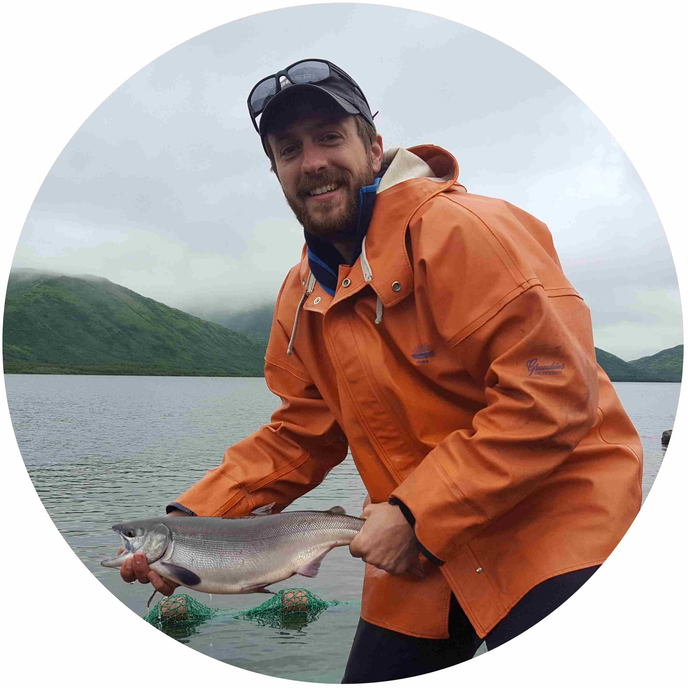

Justin Priest is a fisheries graduate student, interested in modeling ecosystem dynamics. 	

 
Research over the past year has built upon initial results and was presented at several conferences including the American Fisheries Society (AFS) Alaska Student Symposium (where it won the St Hubert Research award for Best Introduction), AFS Western Division Annual Meeting, and at the AFS Western Division Student Colloquium in Corbett, Oregon. The analyses for these presentations used varied statistical approaches including non-Metric Dimensional Scaling and PERMANOVA modeling to make assessments about how the fish communities responded to or were associated with different environmental conditions. testing

During 2018, progress has continued on my graduate research, focusing on changes in the nearshore fish community of Prudhoe Bay, Alaska. This year I participated in my second year of fieldwork in Prudhoe Bay, assisting with project deployment and demonstrating how to operate and sample all field sites. Initial work on my personal thesis project began during 2017 once UAF had possession of the 2001–2016 catch database. Since then, I have been working on data management on the database, primarily quality control and quality assurance (QA/QC). Work doing QA/QC has identified dozens of errors and other various issues. Data were all imported into the statistical software R using a script file that automatically parses out the database and fixes any errors. In this way, the QA/QC process identifies which corrections have been made and documents this for future analysis. There have been several QA/QC improvements this year. Notably, all issues found during routine checks in 2018 have gone into an R script file to automatically flag such issues in the future, thereby saving time and standardizing the process. Other R scripts built this year will assist with project reporting in future years. These include seasonal summaries of catch and length trends for major species (which will be summarized as sections in the report), as well as automatic export and (unformatted) creation of most of the tables, figures, and appendices for the annual report.
